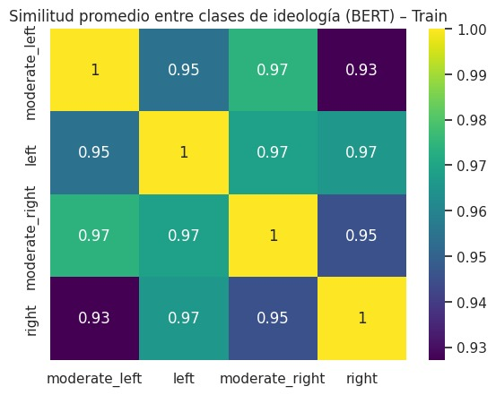
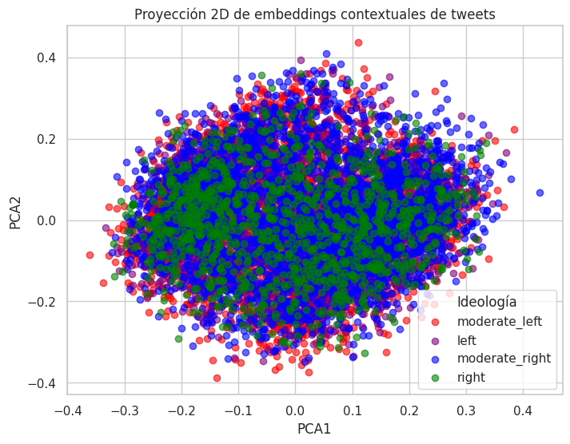
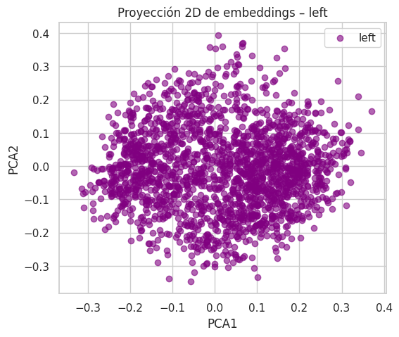
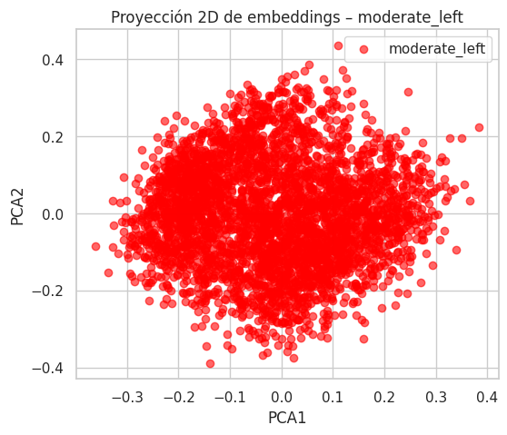
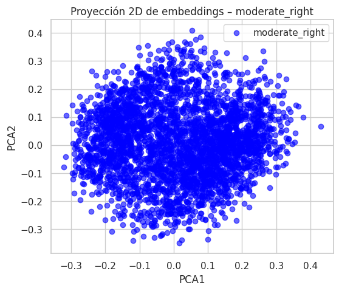
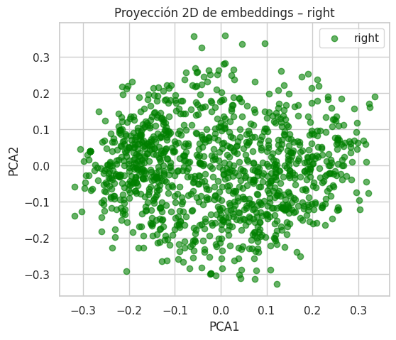

# Análisis de polarización ideológica en Twitter
**Proyecto Final - Tratamiento de Datos**


## Autores
- Patricia Barbero Rodríguez — 100363955  
- Gorka Bernad Santos — 100451457  
- Macarena Fernández Rodríguez — 100384038  
- Belén Larrabeiti Martínez — 100384072  

---

## Descripción del problema

Este proyecto estudia la relación entre contenido ideológico y patrones lingüísticos en twitter con el objetivo de:

- Identificar la orientación ideológica de distintas publicaciones.
- Analizar la polarización ideológica mediante los embeddings.
- Comparar estrategias de modelado y embeddings.

Para ello utilizamos el conjunto de datos: POLITiCES 2023: Political Ideology and Power in Spanish Society (dado en el documento)

## Descripción del conjunto de datos

### Resumen

| Característica | Valor |
|---|---:|
| Número de filas | 14400 |
| Número de columnas | 6 |

### Columnas y tipos

| Columna | Tipo |
|---|---|
| label | object |
| gender | object |
| profession | object |
| ideology_binary | object |
| ideology_multiclass | object |
| tweet | object |

### Valores nulos por columna

| Columna | Nulos |
|---|---:|
| label | 0 |
| gender | 0 |
| profession | 0 |
| ideology_binary | 0 |
| ideology_multiclass | 0 |
| tweet | 0 |

### Valores únicos por columna

| Columna | Valores únicos |
|---|---:|
| label | 360 |
| gender | 2 |
| profession | 3 |
| ideology_binary | 2 |
| ideology_multiclass | 4 |
| tweet | 14384 |


**OBSERVACIONES:**

- Dataset desbalanceado (clases left y right están subrepresentadas)
- Datos muy genéricos (tweets que no muestran ideología en su mayoría)

---

## Metodología

### Parte 1: Análisis exploratorio del conjunto de datos

Se ha realizado un análisis exploratorio inicial con el objetivo de comprender la estructura, composición y características generales del conjunto de datos antes del preprocesado y el modelado. Este análisis incluye las siguientes visualizaciones y observaciones:

---

#### Distribución de tweets por variables demográficas e ideológicas


La figura muestra que el conjunto de datos no está distribuido de forma uniforme. La mayoría de los tweets proceden de autores masculinos y del perfil profesional de periodista. En cuanto a la ideología, las clases moderadas concentran un mayor número de muestras, mientras que las posiciones ideológicas extremas están menos representadas. Esta visualización ofrece una primera visión general de la composición del dataset antes del modelado.

---

#### Distribución conjunta de ideología con género y profesión


La figura representa la distribución conjunta de la ideología según el género y la profesión. En ambos casos se observa que las categorías *moderate_left* y *moderate_right* concentran la mayor parte de los tweets dentro de cada subgrupo. El reparto ideológico es similar entre hombres y mujeres, así como entre periodistas, políticos y celebridades, aunque existen diferencias en el volumen total de tweets por categoría. Esta visualización permite contextualizar cómo se distribuyen las ideologías dentro de los distintos perfiles del dataset.

---

#### Distribución de la longitud de los tweets


La figura muestra la distribución de la longitud de los tweets medida en número de palabras. La mayor parte de los mensajes se concentra en un rango intermedio, aproximadamente entre 10 y 45 palabras, con una menor frecuencia de tweets muy cortos o muy largos. Esta distribución sugiere una variabilidad moderada en la extensión de los textos, adecuada para el análisis de patrones lingüísticos sin predominio claro de mensajes extremos en longitud.

---

#### Análisis léxico preliminar mediante nubes de palabras (sin limpieza)

  
  


Las visualizaciones muestran que, independientemente de si los tweets se agrupan por profesión, ideología o género, predominan palabras muy frecuentes y poco informativas como artículos, preposiciones, pronombres y marcas técnicas propias de Twitter (por ejemplo, *user* y *hashtag*). Estas palabras aparecen de forma muy similar en todos los grupos, lo que dificulta identificar diferencias reales en el contenido ideológico o discursivo.

En conjunto, las nubes evidencian que el texto bruto contiene un alto nivel de ruido lingüístico y numerosos elementos comunes que no aportan significado semántico relevante. Esto justifica la necesidad de aplicar un proceso de limpieza y preprocesado del texto antes de cualquier representación vectorial o fase de modelado, con el objetivo de eliminar términos vacíos y resaltar palabras con mayor capacidad discriminativa.

---

#### Comparación de la longitud de los tweets por ideología


La figura muestra la distribución de la longitud de los tweets, medida en número de palabras, para cada ideología. Se observa que las cuatro categorías presentan rangos y medianas similares, con una dispersión comparable y sin diferencias claras en la extensión de los mensajes. Esto indica que la longitud del tweet no varía de forma apreciable entre ideologías y que, a priori, no parece un factor diferenciador dentro del conjunto de datos.


### Parte 2: Representación vectorial del texto

Antes de aplicar cualquier técnica de representación vectorial, se realizó un **preprocesado del texto** sobre todos los tweets del conjunto de datos. Este proceso de limpieza incluye la eliminación de palabras vacías (artículos, preposiciones), menciones a usuarios (`@user`), URLs y otros elementos propios de Twitter que no aportan información semántica relevante y pueden obstaculizar el entrenamiento y el análisis posterior.

A continuación, se comparan tres estrategias diferentes de representación del texto.

---

#### 1) Representación léxica mediante TF-IDF

Se utilizó un modelo **TF-IDF (Term Frequency–Inverse Document Frequency)** como representación léxica, implementado mediante `TfidfVectorizer` de *scikit-learn*. Esta técnica genera una matriz dispersa (*sparse*) que refleja la importancia relativa de cada término en el conjunto de documentos, y que posteriormente se emplea como entrada para los modelos de clasificación.

##### Dimensiones resultantes de la matriz TF-IDF

- Train set: **(10080, 5000)**
- Validation set: **(4320, 5000)**
- Test set: **(3600, 5000)**

##### Palabras con mayor peso TF-IDF

```
gracias       120.42
gobierno      114.02
españa        108.05
años          103.32
ley            73.89
madrid         73.56
gente          62.00
mundo          57.87
año            57.62
país           56.74
vida           51.56
política       51.05
cosas          50.53
trabajo        46.41
mujeres        45.46
presidente     45.33
izquierda      43.92
personas       43.69
partido        43.17
historia       42.03
```

##### Nubes de palabras tras limpieza del texto (TF-IDF)

**Ideología: Left**  


**Ideología: Moderate Left**  


**Ideología: Right**  


**Ideología: Moderate Right**  


---

#### 2) Representación semántica mediante Word2Vec

Para la representación semántica se entrenó un modelo **Word2Vec** sobre el corpus de tweets ya limpiados. Dado que Word2Vec genera embeddings a nivel de palabra, la representación final de cada tweet se obtuvo combinando dos agregaciones:

- El **promedio** de los embeddings de todas las palabras del tweet.
- El **máximo** elemento a elemento de esos embeddings.

Ambos vectores se concatenaron para formar la representación final de cada tweet.

##### Visualización de embeddings promedio por ideología

**Embeddings promedio – conjunto de entrenamiento**  


**Embeddings promedio – Moderate Left**  


**Embeddings promedio – Left**  


**Embeddings promedio – Moderate Right**  


**Embeddings promedio – Right**  


**Matriz de similitud semántica promedio entre clases ideológicas**


## 3) Embeddings contextuales con BERT

Para capturar relaciones semánticas dependientes del contexto, se utilizaron **embeddings contextuales** basados en el modelo  
`sentence-transformers/distiluse-base-multilingual-cased-v2`.  
A diferencia de TF-IDF y Word2Vec, este enfoque genera una representación vectorial a nivel de frase completa, teniendo en cuenta el significado de cada palabra en función de su contexto.

### Similitud media entre clases ideológicas (BERT)

La siguiente matriz de similitud muestra la similitud coseno promedio entre los embeddings de las distintas clases ideológicas en el conjunto de entrenamiento.



Se observa una **alta similitud global** entre todas las clases, especialmente entre las ideologías moderadas, lo que refuerza la idea de que el espacio ideológico aprendido por BERT es continuo y que las fronteras entre clases no son claramente separables.

### Proyección 2D de los embeddings (PCA)

Utilizando "sentence-transformers/distiluse-base-multilingual-cased-v2", se obtuvieron embeddings que capturan las relaciones semánticas, desambiguación por contexto y similitud semántica entre frases completas.

#### Proyección global por ideología



La figura muestra un solapamiento considerable entre las distintas ideologías. Aunque existen ligeras tendencias de agrupación, no se aprecian clusters claramente separados, lo que explica la dificultad de los modelos para discriminar entre clases.

#### Proyección individual por clase ideológica

**Left**


**Moderate Left**


**Moderate Right**


**Right**



