# Análisis de polarización ideológica en Twitter
**Proyecto Final - Tratamiento de Datos**


## Autores
- Patricia Barbero Rodríguez — 100363955  
- Gorka Bernad Santos — 100451457  
- Macarena Fernández Rodríguez — 100384038  
- Belén Larrabeiti Martínez — 100384072  

---

## Descripción del problema

Este proyecto estudia la relación entre contenido ideológico y patrones lingüísticos en twitter con el objetivo de:

- Identificar la orientación ideológica de distintas publicaciones.
- Analizar la polarización ideológica mediante los embeddings.
- Comparar estrategias de modelado y embeddings.

Para ello utilizamos el conjunto de datos: POLITiCES 2023: Political Ideology and Power in Spanish Society (dado en el documento)

## Descripción del conjunto de datos

### Resumen

| Característica | Valor |
|---|---:|
| Número de filas | 14400 |
| Número de columnas | 6 |

### Columnas y tipos

| Columna | Tipo |
|---|---|
| label | object |
| gender | object |
| profession | object |
| ideology_binary | object |
| ideology_multiclass | object |
| tweet | object |

### Valores nulos por columna

| Columna | Nulos |
|---|---:|
| label | 0 |
| gender | 0 |
| profession | 0 |
| ideology_binary | 0 |
| ideology_multiclass | 0 |
| tweet | 0 |

### Valores únicos por columna

| Columna | Valores únicos |
|---|---:|
| label | 360 |
| gender | 2 |
| profession | 3 |
| ideology_binary | 2 |
| ideology_multiclass | 4 |
| tweet | 14384 |


**OBSERVACIONES:**

- Dataset desbalanceado (clases left y right están subrepresentadas)
- Datos muy genéricos (tweets que no muestran ideología en su mayoría)

---

## Metodología

### Parte 1: Análisis exploratorio del conjunto de datos

Se ha realizado un análisis exploratorio inicial con el objetivo de comprender la estructura, composición y características generales del conjunto de datos antes del preprocesado y el modelado. Este análisis incluye las siguientes visualizaciones y observaciones:

---

#### Distribución de tweets por variables demográficas e ideológicas


La figura muestra que el conjunto de datos no está distribuido de forma uniforme. La mayoría de los tweets proceden de autores masculinos y del perfil profesional de periodista. En cuanto a la ideología, las clases moderadas concentran un mayor número de muestras, mientras que las posiciones ideológicas extremas están menos representadas. Esta visualización ofrece una primera visión general de la composición del dataset antes del modelado.

---

#### Distribución conjunta de ideología con género y profesión

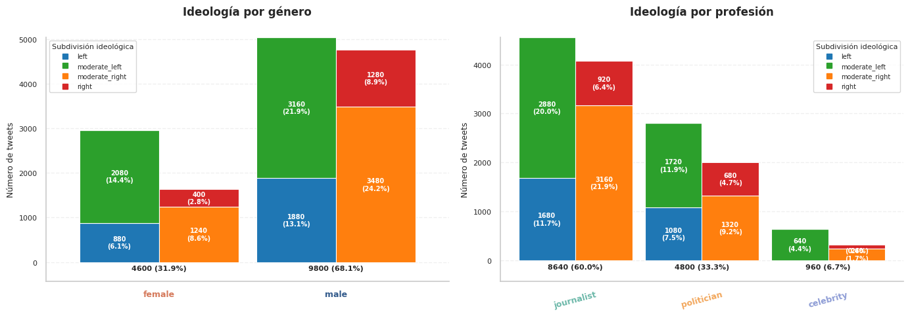

La figura representa la distribución conjunta de la ideología según el género y la profesión. En ambos casos se observa que las categorías *moderate_left* y *moderate_right* concentran la mayor parte de los tweets dentro de cada subgrupo. El reparto ideológico es similar entre hombres y mujeres, así como entre periodistas, políticos y celebridades, aunque existen diferencias en el volumen total de tweets por categoría. Esta visualización permite contextualizar cómo se distribuyen las ideologías dentro de los distintos perfiles del dataset.

---

#### Distribución de la longitud de los tweets

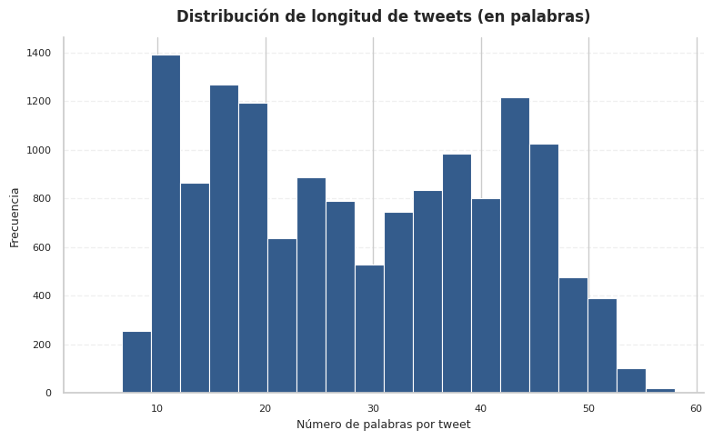

La figura muestra la distribución de la longitud de los tweets medida en número de palabras. La mayor parte de los mensajes se concentra en un rango intermedio, aproximadamente entre 10 y 45 palabras, con una menor frecuencia de tweets muy cortos o muy largos. Esta distribución sugiere una variabilidad moderada en la extensión de los textos, adecuada para el análisis de patrones lingüísticos sin predominio claro de mensajes extremos en longitud.

---

#### Análisis léxico preliminar mediante nubes de palabras (sin limpieza)

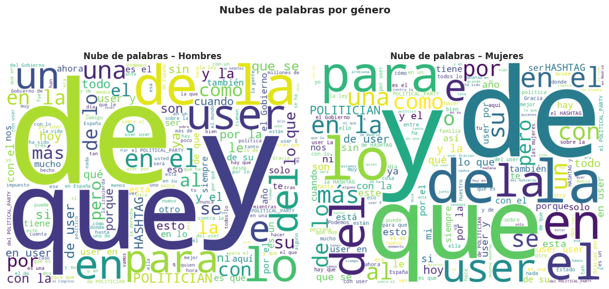  
  


Las visualizaciones muestran que, independientemente de si los tweets se agrupan por profesión, ideología o género, predominan palabras muy frecuentes y poco informativas como artículos, preposiciones, pronombres y marcas técnicas propias de Twitter (por ejemplo, *user* y *hashtag*). Estas palabras aparecen de forma muy similar en todos los grupos, lo que dificulta identificar diferencias reales en el contenido ideológico o discursivo.

En conjunto, las nubes evidencian que el texto bruto contiene un alto nivel de ruido lingüístico y numerosos elementos comunes que no aportan significado semántico relevante. Esto justifica la necesidad de aplicar un proceso de limpieza y preprocesado del texto antes de cualquier representación vectorial o fase de modelado, con el objetivo de eliminar términos vacíos y resaltar palabras con mayor capacidad discriminativa.

---

#### Comparación de la longitud de los tweets por ideología

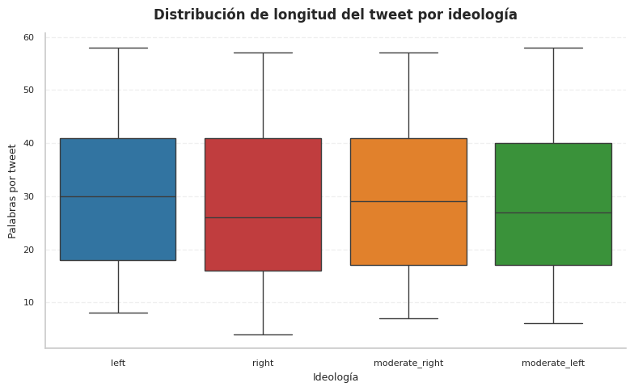

La figura muestra la distribución de la longitud de los tweets, medida en número de palabras, para cada ideología. Se observa que las cuatro categorías presentan rangos y medianas similares, con una dispersión comparable y sin diferencias claras en la extensión de los mensajes. Esto indica que la longitud del tweet no varía de forma apreciable entre ideologías y que, a priori, no parece un factor diferenciador dentro del conjunto de datos.


### Parte 2: Representación vectorial del texto

Antes de aplicar cualquier técnica de representación vectorial, se realizó un **preprocesado del texto** sobre todos los tweets del conjunto de datos. Este proceso de limpieza incluye la eliminación de palabras vacías (artículos, preposiciones), menciones a usuarios (`@user`), URLs y otros elementos propios de Twitter que no aportan información semántica relevante y pueden obstaculizar el entrenamiento y el análisis posterior.

A continuación, se comparan tres estrategias diferentes de representación del texto.

---

#### 1) Representación léxica mediante TF-IDF

Se utilizó un modelo **TF-IDF (Term Frequency–Inverse Document Frequency)** como representación léxica, implementado mediante `TfidfVectorizer` de *scikit-learn*. Esta técnica genera una matriz dispersa (*sparse*) que refleja la importancia relativa de cada término en el conjunto de documentos, y que posteriormente se emplea como entrada para los modelos de clasificación.

##### Dimensiones resultantes de la matriz TF-IDF

- Train set: **(10080, 5000)**
- Validation set: **(4320, 5000)**
- Test set: **(3600, 5000)**

##### Palabras con mayor peso TF-IDF

```
gracias       120.42
gobierno      114.02
españa        108.05
años          103.32
ley            73.89
madrid         73.56
gente          62.00
mundo          57.87
año            57.62
país           56.74
vida           51.56
política       51.05
cosas          50.53
trabajo        46.41
mujeres        45.46
presidente     45.33
izquierda      43.92
personas       43.69
partido        43.17
historia       42.03
```

##### Nubes de palabras tras limpieza del texto (TF-IDF)

**Ideología: Left**  
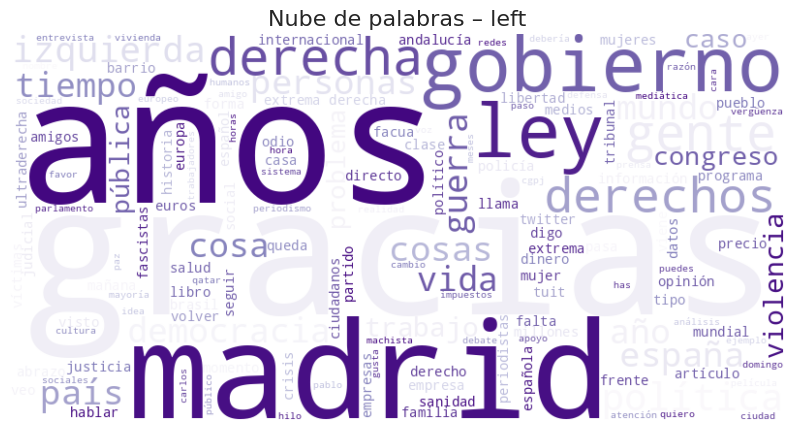

**Ideología: Moderate Left**  
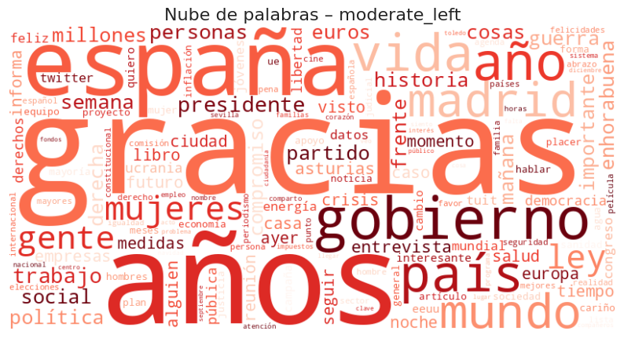

**Ideología: Right**  
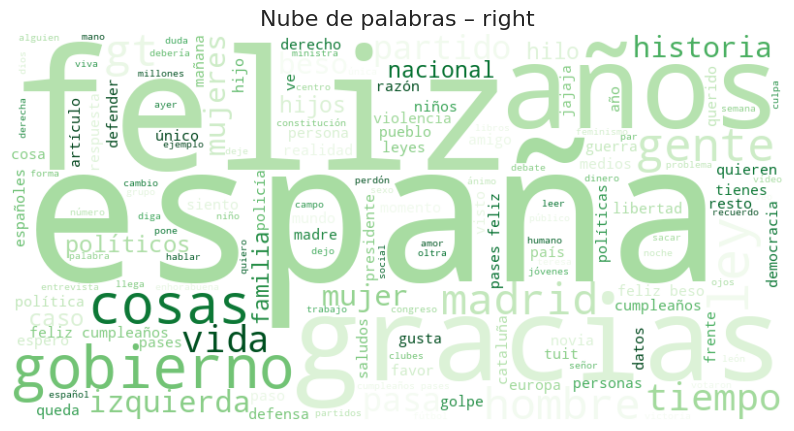

**Ideología: Moderate Right**  
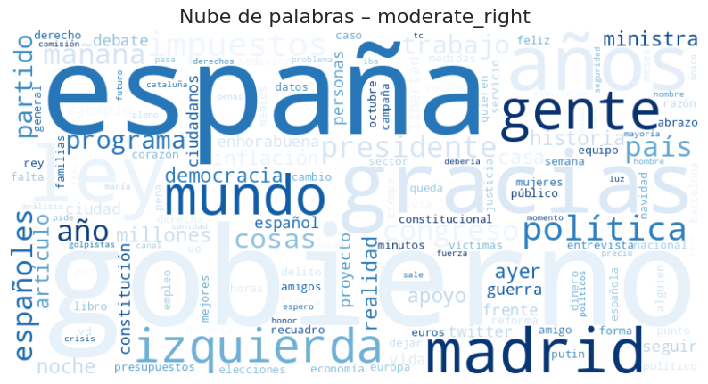

---

#### 2) Representación semántica mediante Word2Vec

Para la representación semántica se entrenó un modelo **Word2Vec** sobre el corpus de tweets ya limpiados. Dado que Word2Vec genera embeddings a nivel de palabra, la representación final de cada tweet se obtuvo combinando dos agregaciones:

- El **promedio** de los embeddings de todas las palabras del tweet.
- El **máximo** elemento a elemento de esos embeddings.

Ambos vectores se concatenaron para formar la representación final de cada tweet.

##### Visualización de embeddings promedio por ideología

**Embeddings promedio – conjunto de entrenamiento**  
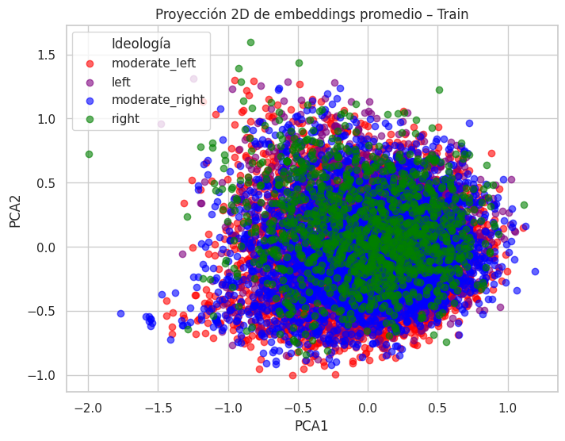

**Embeddings promedio – Moderate Left**  
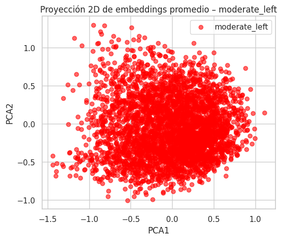

**Embeddings promedio – Left**  
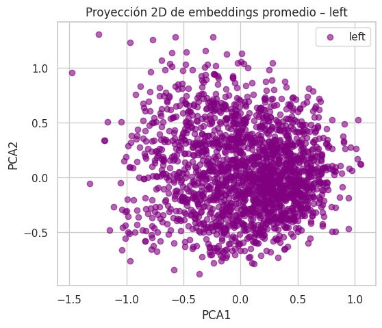

**Embeddings promedio – Moderate Right**  
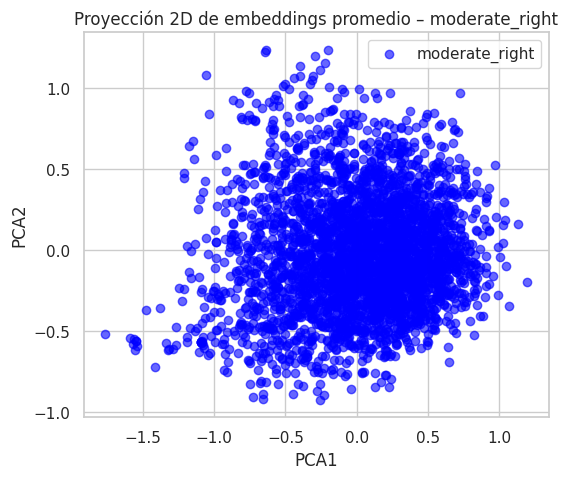

**Embeddings promedio – Right**  
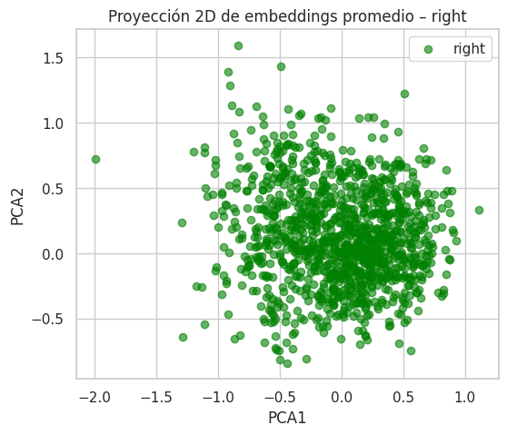

**Matriz de similitud semántica promedio entre clases ideológicas**
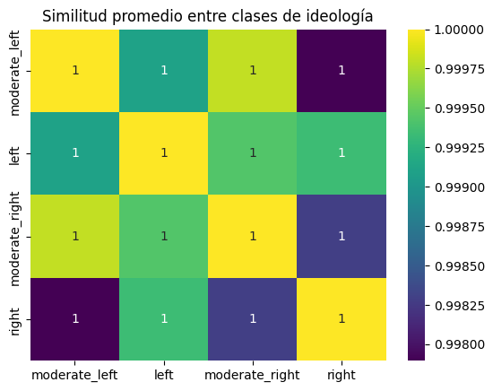

#### 3) BERT Embeddings (Contextuales)

Utilizando "sentence-transformers/distiluse-base-multilingual-cased-v2", se obtuvieron embeddings que capturan las relaciones semánticas, desambiguación por contexto y similitud semántica entre frases completas.


## Modelado y evaluación

Se han entrenado, haciendo uso de cada una de las representaciones vectoriales, un regresor logístico, un svm, y una red neuronal para poder evaluar su rendimiento:

### TF-IDF

==== VAL LR + TFIDF ====
                precision    recall  f1-score   support

          left       0.32      0.40      0.36       828
 moderate_left       0.51      0.44      0.47      1572
moderate_right       0.49      0.41      0.45      1416
         right       0.23      0.35      0.28       504

      accuracy                           0.41      4320
     macro avg       0.39      0.40      0.39      4320
  weighted avg       0.44      0.41      0.42      4320

==== TEST LR + TFIDF ====
                precision    recall  f1-score   support

          left       0.27      0.35      0.31       640
 moderate_left       0.49      0.39      0.43      1440
moderate_right       0.43      0.41      0.42      1080
         right       0.23      0.31      0.26       440

      accuracy                           0.38      3600
     macro avg       0.36      0.37      0.36      3600
  weighted avg       0.40      0.38      0.39      3600

==== VAL SVM + TFIDF ====
                precision    recall  f1-score   support

          left       0.31      0.40      0.35       828
 moderate_left       0.51      0.45      0.48      1572
moderate_right       0.50      0.40      0.44      1416
         right       0.24      0.34      0.28       504

      accuracy                           0.41      4320
     macro avg       0.39      0.40      0.39      4320
  weighted avg       0.44      0.41      0.42      4320

==== TEST SVM + TFIDF ====
                precision    recall  f1-score   support

          left       0.26      0.37      0.30       640
 moderate_left       0.48      0.37      0.42      1440
moderate_right       0.42      0.39      0.40      1080
         right       0.22      0.28      0.24       440

      accuracy                           0.36      3600
     macro avg       0.34      0.35      0.34      3600
  weighted avg       0.39      0.36      0.37      3600

=== TEST MLP + TF-IDF ===
             precision    recall  f1-score   support

           0       0.27      0.25      0.26       640
           1       0.47      0.45      0.46      1440
           2       0.39      0.46      0.42      1080
           3       0.25      0.22      0.24       440

    accuracy                           0.39      3600
   macro avg       0.35      0.34      0.34      3600
weighted avg       0.39      0.39      0.39      3600


### Interpretación de resultados con TF-IDF

Observando los resultados obtenidos, se puede ver que para los tres modelos entrenados el accuracy no es muy elevado. En los sets de validación el regresor logístico obtiene un accuracy de 38%, el SVM de 36% y red neuronal entrenada con 10 épocas y usando la técnica de generalización de dropout obtiene de accuracy un 39%. Aunque a la red neuronal se le ha dado algo mejor, no es significativo. En general, a los tres modelos entrenados se les ha dado bastante mal clasificar la ideología política de los tweets.
 
Esto se debe a que los tweets del dataset son ambiguos y es muy complicado que los modelos consigan encontrar un patrón significativo que consiga diferenciar las 4 clases. 

Es importante destacar que los resultados obtenidos tanto en el set de validación como en el set de test son muy similares. Se puede concluir que no ha habido sobreajuste significativos.

De las 4 clases, a los 3 modelos les cuesta más clasificar los extremos y la clase que mejor clasifica es ‘moderate_left’, ya que presenta valores más bajos de precisión y recall.

### Word2Vec

==== VAL LR + Word2Vec ====
                precision    recall  f1-score   support

          left       0.25      0.32      0.29       828
 moderate_left       0.47      0.34      0.40      1572
moderate_right       0.42      0.31      0.36      1416
         right       0.19      0.40      0.26       504

      accuracy                           0.34      4320
     macro avg       0.33      0.34      0.32      4320
  weighted avg       0.38      0.34      0.35      4320

==== TEST LR + Word2Vec ====
                precision    recall  f1-score   support

          left       0.21      0.29      0.24       640
 moderate_left       0.46      0.30      0.36      1440
moderate_right       0.39      0.31      0.35      1080
         right       0.18      0.36      0.24       440

      accuracy                           0.31      3600
     macro avg       0.31      0.32      0.30      3600
  weighted avg       0.36      0.31      0.32      3600
==== VAL SVM + Word2Vec ====
                precision    recall  f1-score   support

          left       0.25      0.36      0.30       828
 moderate_left       0.48      0.34      0.39      1572
moderate_right       0.41      0.28      0.33      1416
         right       0.18      0.38      0.25       504

      accuracy                           0.33      4320
     macro avg       0.33      0.34      0.32      4320
  weighted avg       0.38      0.33      0.34      4320

==== TEST SVM + Word2Vec ====
                precision    recall  f1-score   support

          left       0.21      0.34      0.26       640
 moderate_left       0.48      0.30      0.37      1440
moderate_right       0.40      0.28      0.33      1080
         right       0.19      0.39      0.26       440

      accuracy                           0.31      3600
     macro avg       0.32      0.33      0.30      3600
  weighted avg       0.37      0.31      0.32      3600
=== TEST MLP + Word2Vec ===
              precision    recall  f1-score   support

           0       0.22      0.10      0.14       640
           1       0.46      0.44      0.45      1440
           2       0.43      0.02      0.04      1080
           3       0.17      0.74      0.28       440

    accuracy                           0.29      3600
   macro avg       0.32      0.33      0.23      3600
weighted avg       0.37      0.29      0.25      3600

### Interpretación de resultados con Word2Vec
Los resultados obtenidos con Word2Vec son claramente inferiores a los alcanzados con TF-IDF y BERT. En todos los modelos evaluados, la accuracy se sitúa alrededor del 30% - 34%, con valores de F1-score bajos, lo que indica dificultades para clasificar todas las clases ideológicas.
Esta pérdida de rendimiento puede atribuirse a la naturaleza de Word2Vec, que genera  embeddings a nivel de palabra y requiere una agregación simple (promedio y máximo) para representar frases completas. Este proceso elimina información contextual clave, especialmente relevante en el discurso político, donde el significado ideológico depende en gran medida de la combinación y el contexto de las palabras.

La red neuronal multicapa presenta un comportamiento inestable, con recalls muy bajos para algunas clases y muy altos para otras, lo que sugiere un colapso hacia determinadas categorías. En conjunto, estos resultados indican que Word2Vec no resulta adecuado para esta tarea sin mecanismo de contextualización.

### BERT

==== VAL LR + BERT ====
                precision    recall  f1-score   support

          left       0.31      0.38      0.34       828
 moderate_left       0.51      0.39      0.44      1572
moderate_right       0.45      0.31      0.37      1416
         right       0.23      0.51      0.32       504

      accuracy                           0.38      4320
     macro avg       0.37      0.40      0.37      4320
  weighted avg       0.42      0.38      0.38      4320

==== TEST LR + BERT ====
                precision    recall  f1-score   support

          left       0.26      0.35      0.30       640
 moderate_left       0.55      0.36      0.43      1440
moderate_right       0.46      0.38      0.41      1080
         right       0.24      0.49      0.32       440

      accuracy                           0.38      3600
     macro avg       0.38      0.39      0.37      3600
  weighted avg       0.43      0.38      0.39      3600
==== VAL SVM + BERT ====
                precision    recall  f1-score   support

          left       0.31      0.39      0.34       828
 moderate_left       0.52      0.37      0.44      1572
moderate_right       0.47      0.32      0.38      1416
         right       0.23      0.55      0.32       504

      accuracy                           0.38      4320
     macro avg       0.38      0.41      0.37      4320
  weighted avg       0.43      0.38      0.39      4320

==== TEST SVM + BERT ====
                precision    recall  f1-score   support

          left       0.27      0.38      0.31       640
 moderate_left       0.56      0.34      0.43      1440
moderate_right       0.46      0.36      0.40      1080
         right       0.23      0.50      0.32       440

      accuracy                           0.37      3600
     macro avg       0.38      0.40      0.36      3600
  weighted avg       0.44      0.37      0.38      3600
=== TEST MLP + BERT ===
              precision    recall  f1-score   support

           0       0.27      0.29      0.28       640
           1       0.52      0.44      0.48      1440
           2       0.39      0.55      0.46      1080
           3       0.30      0.12      0.18       440

    accuracy                           0.41      3600
   macro avg       0.37      0.35      0.35      3600
weighted avg       0.41      0.41      0.40      3600


### Interpretación de resultados con BERT

Los modelos entrenados con embeddings contextuales de BERT muestran una mejora respecto a Word2Vec y resultados comparables ligeramente superiores a TF-IDF. La accuaracy está entre el 37% y el 41%, siendo la red neuronal multicapa el módulo con mejor rendimiento en el conjunto de test.

El uso de embeddings contextuales permite capturar relaciones semánticas más complejas y dependientes del contexto, lo que se refleja en una mejore recuperación de las clases moderadas y una ligera mejora en la clasificación de las ideologías no moderadas.

A pesar de esta mejora, los resultados siguen siendo moderados, lo que indica que incluso con representaciones avanzadas el problema sigue existiendo. La ambigüedad del lenguaje político y la escasa explicitud ideológica de muchos tweets limitan el rendimiento máximo alcanzable por estos modelos.

### Interpretación general de los resultados

De forma global, los resultados obtenidos muestran que la clasificación ideológica de tweets es una tarea compleja y con un margen de mejora limitado, independientemente del modelo utilizado. Ninguna de las combinaciones evaluadas supera claramente el 45 % de accuracy, lo que pone de manifiesto la ambigüedad inherente al lenguaje político en redes sociales.

Las representaciones clásicas basadas en TF-IDF ofrecen un rendimiento competitivo y estable, mientras que Word2Vec resulta claramente insuficiente para esta tarea debido a la pérdida de información contextual. Los embeddings contextuales de BERT proporcionan la mejor base de representación, especialmente cuando se combinan con modelos más expresivos como redes neuronales.

En todos los casos se observa una mayor confusión entre las clases ideológicas moderadas, lo que sugiere que el discurso político real se distribuye de forma continua más que en categorías discretas claramente separables.

### Parte 2: Representación vectorial del texto

Se realizó un preprocesado del texto (limpieza) para eliminar elementos que puedan introducir ruido (por ejemplo menciones, URLs y palabras funcionales).  
Después, se compararon tres estrategias de representación:

1. TF-IDF  
2. Word2Vec  
3. Embeddings contextuales con BERT (Sentence Transformers)

---

## Representaciones

### 1) TF-IDF

Se utilizó `TfidfVectorizer` (scikit-learn). La representación produce una matriz dispersa (sparse) que se usa para el entrenamiento.

#### Dimensiones resultantes

| Conjunto | Dimensiones |
|---|---|
| Train | (10080, 5000) |
| Validation | (4320, 5000) |
| Test | (3600, 5000) |

#### Top de palabras (peso TF-IDF)

```
gracias 120.42329743534857
gobierno 114.02342568299336
españa 108.04524812075806
años 103.31815510207267
ley 73.8876495764722
madrid 73.55735486730096
gente 62.00059070603916
mundo 57.86676803313677
año 57.616455598756076
país 56.73649979797708
vida 51.558217904449194
política 51.050209914265466
cosas 50.534957525232606
trabajo 46.406209030332995
mujeres 45.45618114939983
presidente 45.32934029053684
izquierda 43.91606330164386
personas 43.69479463570944
partido 43.17438344134408
historia 42.03383842885117
```

---

### 2) Word2Vec

Se entrena con un corpus de tweets limpios. Dado que Word2Vec produce embeddings a nivel de palabra, cada tweet se representa concatenando:

- El promedio de embeddings de sus palabras.
- El máximo elemento a elemento de esos embeddings.

---

### 3) BERT Embeddings (Contextuales)

Utilizando `sentence-transformers/distiluse-base-multilingual-cased-v2`, se obtuvieron embeddings a nivel de frase que capturan relaciones semánticas y desambiguación por contexto.

---

## Modelado y evaluación

Para cada representación vectorial se entrenaron:

- Regresión logística (LR)
- SVM
- Red neuronal (MLP)

A continuación se incluyen los resultados (validation y test) tal y como se obtuvieron.

---

## Resultados

### TF-IDF

<details>
<summary>LR + TF-IDF (Validation)</summary>

```
==== VAL LR + TFIDF ====
                precision    recall  f1-score   support

          left       0.32      0.40      0.36       828
 moderate_left       0.51      0.44      0.47      1572
moderate_right       0.49      0.41      0.45      1416
         right       0.23      0.35      0.28       504

      accuracy                           0.41      4320
     macro avg       0.39      0.40      0.39      4320
  weighted avg       0.44      0.41      0.42      4320
```
</details>

<details>
<summary>LR + TF-IDF (Test)</summary>

```
==== TEST LR + TFIDF ====
                precision    recall  f1-score   support

          left       0.27      0.35      0.31       640
 moderate_left       0.49      0.39      0.43      1440
moderate_right       0.43      0.41      0.42      1080
         right       0.23      0.31      0.26       440

      accuracy                           0.38      3600
     macro avg       0.36      0.37      0.36      3600
  weighted avg       0.40      0.38      0.39      3600
```
</details>

<details>
<summary>SVM + TF-IDF (Validation)</summary>

```
==== VAL SVM + TFIDF ====
                precision    recall  f1-score   support

          left       0.31      0.40      0.35       828
 moderate_left       0.51      0.45      0.48      1572
moderate_right       0.50      0.40      0.44      1416
         right       0.24      0.34      0.28       504

      accuracy                           0.41      4320
     macro avg       0.39      0.40      0.39      4320
  weighted avg       0.44      0.41      0.42      4320
```
</details>

<details>
<summary>SVM + TF-IDF (Test)</summary>

```
==== TEST SVM + TFIDF ====
                precision    recall  f1-score   support

          left       0.26      0.37      0.30       640
 moderate_left       0.48      0.37      0.42      1440
moderate_right       0.42      0.39      0.40      1080
         right       0.22      0.28      0.24       440

      accuracy                           0.36      3600
     macro avg       0.34      0.35      0.34      3600
  weighted avg       0.39      0.36      0.37      3600
```
</details>

<details>
<summary>MLP + TF-IDF (Test)</summary>

```
=== TEST MLP + TF-IDF ===
             precision    recall  f1-score   support

           0       0.27      0.25      0.26       640
           1       0.47      0.45      0.46      1440
           2       0.39      0.46      0.42      1080
           3       0.25      0.22      0.24       440

    accuracy                           0.39      3600
   macro avg       0.35      0.34      0.34      3600
weighted avg       0.39      0.39      0.39      3600
```
</details>

---

### Word2Vec

<details>
<summary>LR + Word2Vec (Validation)</summary>

```
==== VAL LR + Word2Vec ====
                precision    recall  f1-score   support

          left       0.25      0.32      0.29       828
 moderate_left       0.47      0.34      0.40      1572
moderate_right       0.42      0.31      0.36      1416
         right       0.19      0.40      0.26       504

      accuracy                           0.34      4320
     macro avg       0.33      0.34      0.32      4320
  weighted avg       0.38      0.34      0.35      4320
```
</details>

<details>
<summary>LR + Word2Vec (Test)</summary>

```
==== TEST LR + Word2Vec ====
                precision    recall  f1-score   support

          left       0.21      0.29      0.24       640
 moderate_left       0.46      0.30      0.36      1440
moderate_right       0.39      0.31      0.35      1080
         right       0.18      0.36      0.24       440

      accuracy                           0.31      3600
     macro avg       0.31      0.32      0.30      3600
  weighted avg       0.36      0.31      0.32      3600
```
</details>

<details>
<summary>SVM + Word2Vec (Validation)</summary>

```
==== VAL SVM + Word2Vec ====
                precision    recall  f1-score   support

          left       0.25      0.36      0.30       828
 moderate_left       0.48      0.34      0.39      1572
moderate_right       0.41      0.28      0.33      1416
         right       0.18      0.38      0.25       504

      accuracy                           0.33      4320
     macro avg       0.33      0.34      0.32      4320
  weighted avg       0.38      0.33      0.34      4320
```
</details>

<details>
<summary>SVM + Word2Vec (Test)</summary>

```
==== TEST SVM + Word2Vec ====
                precision    recall  f1-score   support

          left       0.21      0.34      0.26       640
 moderate_left       0.48      0.30      0.37      1440
moderate_right       0.40      0.28      0.33      1080
         right       0.19      0.39      0.26       440

      accuracy                           0.31      3600
     macro avg       0.32      0.33      0.30      3600
  weighted avg       0.37      0.31      0.32      3600
```
</details>

<details>
<summary>MLP + Word2Vec (Test)</summary>

```
=== TEST MLP + Word2Vec ===
              precision    recall  f1-score   support

           0       0.22      0.10      0.14       640
           1       0.46      0.44      0.45      1440
           2       0.43      0.02      0.04      1080
           3       0.17      0.74      0.28       440

    accuracy                           0.29      3600
   macro avg       0.32      0.33      0.23      3600
weighted avg       0.37      0.29      0.25      3600
```
</details>

---

### BERT

<details>
<summary>LR + BERT (Validation)</summary>

```
==== VAL LR + BERT ====
                precision    recall  f1-score   support

          left       0.31      0.38      0.34       828
 moderate_left       0.51      0.39      0.44      1572
moderate_right       0.45      0.31      0.37      1416
         right       0.23      0.51      0.32       504

      accuracy                           0.38      4320
     macro avg       0.37      0.40      0.37      4320
  weighted avg       0.42      0.38      0.38      4320
```
</details>

<details>
<summary>LR + BERT (Test)</summary>

```
==== TEST LR + BERT ====
                precision    recall  f1-score   support

          left       0.26      0.35      0.30       640
 moderate_left       0.55      0.36      0.43      1440
moderate_right       0.46      0.38      0.41      1080
         right       0.24      0.49      0.32       440

      accuracy                           0.38      3600
     macro avg       0.38      0.39      0.37      3600
  weighted avg       0.43      0.38      0.39      3600
```
</details>

<details>
<summary>SVM + BERT (Validation)</summary>

```
==== VAL SVM + BERT ====
                precision    recall  f1-score   support

          left       0.31      0.39      0.34       828
 moderate_left       0.52      0.37      0.44      1572
moderate_right       0.47      0.32      0.38      1416
         right       0.23      0.55      0.32       504

      accuracy                           0.38      4320
     macro avg       0.38      0.41      0.37      4320
  weighted avg       0.43      0.38      0.39      4320
```
</details>

<details>
<summary>SVM + BERT (Test)</summary>

```
==== TEST SVM + BERT ====
                precision    recall  f1-score   support

          left       0.27      0.38      0.31       640
 moderate_left       0.56      0.34      0.43      1440
moderate_right       0.46      0.36      0.40      1080
         right       0.23      0.50      0.32       440

      accuracy                           0.37      3600
     macro avg       0.38      0.40      0.36      3600
  weighted avg       0.44      0.37      0.38      3600
```
</details>

<details>
<summary>MLP + BERT (Test)</summary>

```
=== TEST MLP + BERT ===
              precision    recall  f1-score   support

           0       0.27      0.29      0.28       640
           1       0.52      0.44      0.48      1440
           2       0.39      0.55      0.46      1080
           3       0.30      0.12      0.18       440

    accuracy                           0.41      3600
   macro avg       0.37      0.35      0.35      3600
weighted avg       0.41      0.41      0.40      3600
```
</details>

---

### Modelo Hugging Face

<details>
<summary>Resultados (Validation)</summary>

```
Resultados en Validation:
  • Accuracy:    0.4567
  • F1-macro:    0.4040
  • F1-weighted: 0.4484
  • Loss:        1.2582

CLASSIFICATION REPORT - VALIDATION
                precision    recall  f1-score   support

          left       0.33      0.33      0.33       828
 moderate_left       0.51      0.62      0.56      1572
moderate_right       0.49      0.44      0.46      1416
         right       0.34      0.22      0.27       504

      accuracy                           0.46      4320
     macro avg       0.42      0.40      0.40      4320
  weighted avg       0.45      0.46      0.45      4320
```
</details>

<details>
<summary>Resultados (Test)</summary>

```
EVALUACIÓN FINAL CON TEST SET

Resultados en Test:
  • Accuracy:    0.4350
  • F1-macro:    0.3788
  • F1-weighted: 0.4296

CLASSIFICATION REPORT - TEST
                precision    recall  f1-score   support

          left       0.28      0.31      0.29       640
 moderate_left       0.51      0.56      0.54      1440
moderate_right       0.45      0.44      0.45      1080
         right       0.33      0.19      0.24       440

      accuracy                           0.43      3600
     macro avg       0.39      0.38      0.38      3600
  weighted avg       0.43      0.43      0.43      3600
```
</details>

---

## Comparativa final (tabla)

| Modelo | Accuracy | F1-macro | ROC-AUC |
|---|---:|---:|---:|
| LR + TF-IDF | 0.379444 | 0.356050 | 0.635392 |
| SVM + TF-IDF | 0.363611 | 0.341354 | 0.626499 |
| MLP + TF-IDF | 0.388611 | 0.344749 | NaN |
| LR + Word2Vec | 0.310278 | 0.298363 | 0.589339 |
| SVM + Word2Vec | 0.312778 | 0.303818 | 0.591209 |
| MLP + Word2Vec | 0.290833 | 0.228021 | NaN |
| LR + BERT emb | 0.379167 | 0.367103 | 0.645298 |
| SVM + BERT emb | 0.373611 | 0.363960 | 0.643901 |
| MLP + BERT emb | 0.408889 | 0.348186 | NaN |

---

## Parte final: extensión

La extensión escogida para ampliar el proyecto ha sido un análisis más profundo de patrones lingüísticos asociados a la polarización ideológica en tweets.

### 1) Marcadores de polarización

Objetivo: identificar elementos lingüísticos distintivos de las ideologías.

Se calcula la diferencia entre el TF-IDF promedio de una ideología frente a las demás.  
Se identifican palabras:

- Divisoras: términos con uso muy diferente entre ideologías.
- Puente: términos con uso similar en todas las ideologías.

<details>
<summary>Top de palabras distintivas por ideología</summary>

```
TOP LEFT
1. derecha | 0.0044
2. derechos | 0.0043
3. facua | 0.0040
4. extrema derecha | 0.0037
5. fascistas | 0.0032
6. extrema | 0.0031
7. ultraderecha | 0.0027
8. violencia | 0.0026
9. cosa | 0.0026
10. barrio | 0.0025

TOP MODERATE_LEFT
1. asturias | 0.0041
2. compromiso | 0.0032
3. informa | 0.0031
4. gracias | 0.0030
5. mujeres | 0.0030
6. semana | 0.0027
7. importante | 0.0027
8. vida | 0.0026
9. reunión | 0.0025
10. año | 0.0024

TOP MODERATE_RIGHT
1. gobierno | 0.0088
2. españa | 0.0045
3. impuestos | 0.0038
4. españoles | 0.0036
5. recuadro | 0.0035
6. vd | 0.0025
7. programa | 0.0025
8. ley | 0.0025
9. inflación | 0.0025
10. ministra | 0.0024

TOP RIGHT
1. feliz | 0.0089
2. gt | 0.0065
3. beso | 0.0048
4. feliz cumpleaños | 0.0045
5. hombre | 0.0044
6. novia | 0.0042
7. feliz beso | 0.0040
8. hijos | 0.0040
9. cumpleaños | 0.0040
10. pases | 0.0038
```
</details>

<details>
<summary>Palabras divisoras y palabras puente</summary>

```
PALABRAS DIVISORAS
Palabra                     Varianza       Left      Mod-L      Mod-R      Right
gobierno                    0.000312      0.046      0.052      0.089      0.048
españa                      0.000227      0.029      0.052      0.070      0.060
derecha                     0.000132      0.040      0.020      0.014      0.011
feliz                       0.000072      0.003      0.009      0.009      0.026
presidente                  0.000067      0.009      0.027      0.027      0.013
derechos                    0.000061      0.025      0.012      0.008      0.004
ve                          0.000060      0.305      0.288      0.296      0.285
izquierda                   0.000058      0.025      0.007      0.024      0.026
cosa                        0.000054      0.035      0.021      0.024      0.038
gt                          0.000054      0.004      0.006      0.002      0.020
país                        0.000044      0.027      0.038      0.028      0.020
mujer                       0.000040      0.020      0.031      0.017      0.031
españoles                   0.000040      0.005      0.007      0.020      0.015
empresa                     0.000036      0.023      0.020      0.013      0.008
llama                       0.000036      0.024      0.014      0.015      0.028

PALABRAS PUENTE
Palabra                     Varianza       Left      Mod-L      Mod-R      Right
problema                    0.000006      0.019      0.013      0.014      0.014
```
</details>

---

### 2) Polarization score

Para cuantificar el nivel de polarización de tweets individuales se usan embeddings contextuales (BERT). Para cada tweet se calcula:

- Distancia coseno al centro político global (cuanto mayor, más alejado del centro).
- Score ideológico definido como:

```
(dist_left - dist_right) / (dist_left + dist_right)
```

<details>
<summary>Ejemplos</summary>

```
Texto: titular titulamos por el asesino nunca por la mujer que ha sido asesinada el foc...
Ideología real: moderate_left
Distancia al centro: 0.7124
Ideology score: -0.0009 (LEFT)
¿Es extremo?: NO

Texto: tengo el deber de q cada uno de los ciudadanos del país tome una decisión libre ...
Ideología real: moderate_left
Distancia al centro: 0.6884
Ideology score: +0.0024 (RIGHT)
¿Es extremo?: NO
```
</details>

---

### 3) Análisis de confusión del modelo

Se identificaron los tweets donde el modelo falla y las confusiones más frecuentes.

<details>
<summary>Confusiones más frecuentes</summary>

```
TWEETS INCORRECTAMENTE CLASIFICADOS: 2692 de 4320

Confusiones más frecuentes:
real            predicted     
moderate_right  right             351
                moderate_left     328
moderate_left   moderate_right    325
                left              320
                right             314
moderate_right  left              294
left            right             193
                moderate_left     185
                moderate_right    134
right           moderate_right     89
dtype: int64
```
</details>

---

### 4) Sistema interactivo

Sistema que permite analizar un tweet introducido por el usuario, devolviendo:

- Predicción ideológica.
- Distribución de probabilidades.
- Polarization score.
- Palabras divisoras detectadas, si existen.

<details>
<summary>Ejemplo</summary>

```
Escribe un tweet: viva el orden y la ley

TEXTO ORIGINAL:
   viva el orden y la ley

PREDICCIÓN IDEOLÓGICA
   - Ideología predicha: RIGHT

Distribución de probabilidades:
  left                 29.29%
  moderate_left         9.18%
  moderate_right       23.98%
  right                37.55%

POLARIZATION SCORE
   - Distancia al centro político: 0.8589
   - Score: +0.0074

PALABRAS CLAVE DETECTADAS
   No se encontraron palabras divisoras significativas
```
</details>

---

## Conclusiones finales

(Escribir aquí las conclusiones finales del proyecto.)
